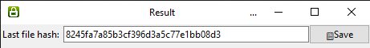

  

# Chrom-Dump
This is an open-source tool for get text base dump file in your Google Chrom History, Downloads, Downloaded file hashes  and Cookies also.

Preview💻 

<h3>#️⃣EXE hash</h3>
8245fa7a85b3cf396d3a5c77e1bb08d3 

<h3>Dependencies</h3>
<li>SQLITE3</li>
<li>Os</li>
<li>Python3</li>

<h3>Availablity</h3>
<li>Windows 10,8.1,7,Vista,Xp,etc</li>

<h3>Reuired Enviroments</h3>
<li>Python3</li>

<h3>License📃</h3>
<li><a href="https://opensource.org/licenses/MIT">MIT License</a></li>

🌍Website: <a href="http://akilabandara.rf.gd/?i=1">Akila Bandara</a>
